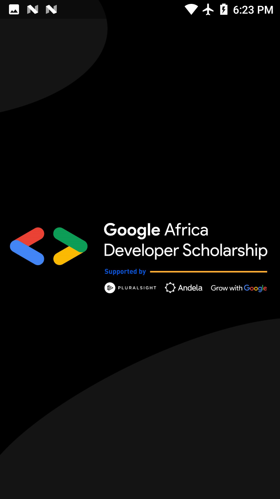
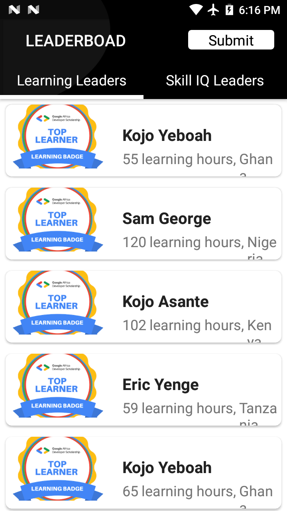
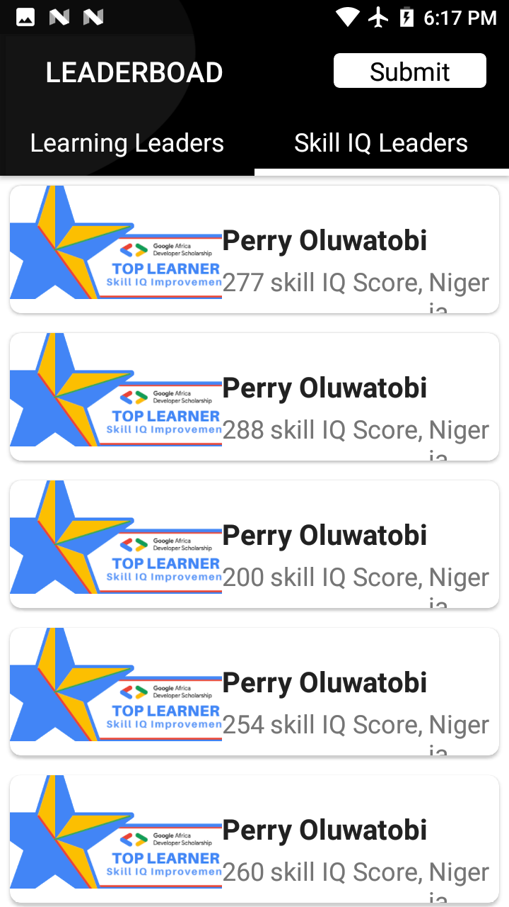
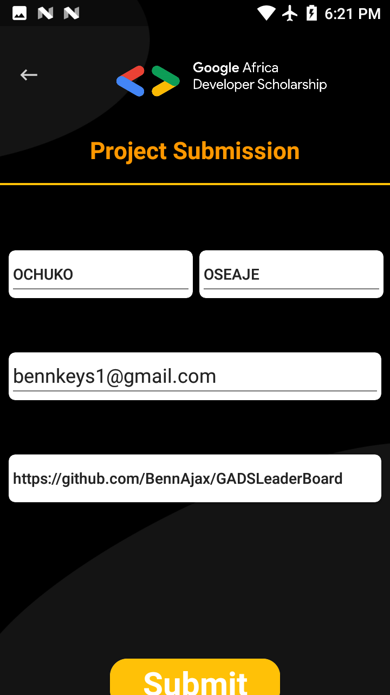
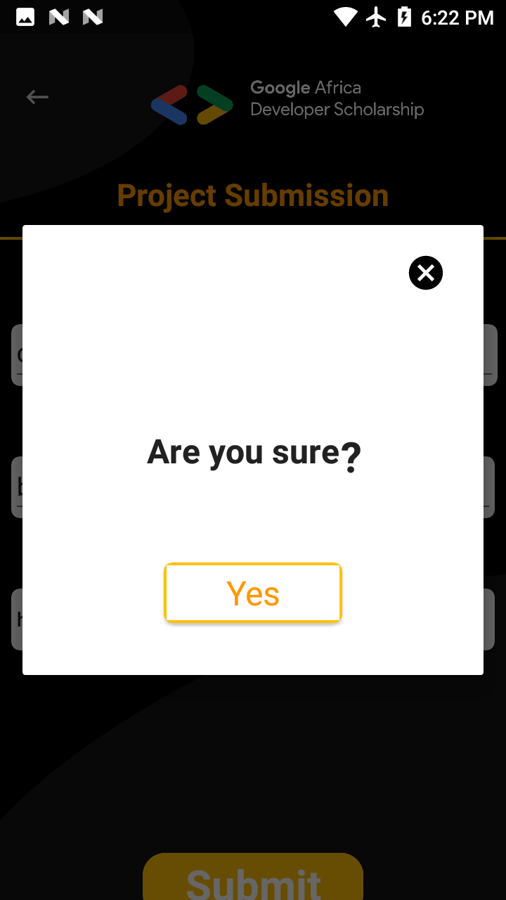
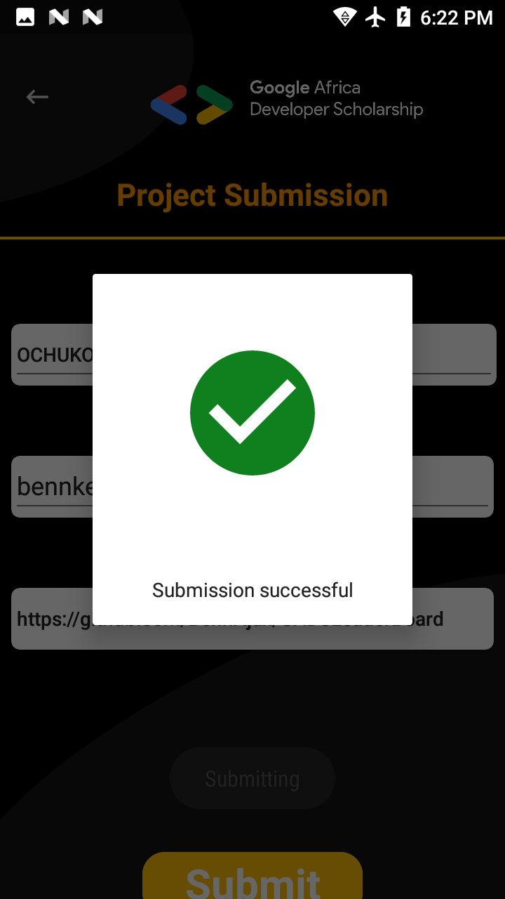

<h1 style="text-align: center;"><strong>Google Africa Developer Scholarship Phase II Associate Android Developer Practice Project
</strong></h1>
## Project Screen Shots

  
  
  

  
  
  

## Google Africa Developer Scholarship Phase II

## Associate Android Developer Practice Project

_Timeline: Friday, Aug 28 - Friday, Sept 11 2020 (2 weeks)_

## Building a GADS Leaderboard Mobile Application

### Description

This project is a very simple Android Project aimed at getting you to implement some simple concepts that are very important as far as Android Development is concerned..

In this project, you are going to implement a mobile design of the GADS 2020 Leaderboard.
The mobile App will display Top 20 learners in the Learning Leaders’ category and Top 20 learners in the Skill IQ Leaders’ category.

### This project will help you understand:
* Multi-Activity Project
* View pager
* Customizing Toolbar
* RecyclerView
* Making Network Request
* Working with Google Form and many more...

### Resources

> The data  for your List should be gotten by making a network request the following API endpoints.
> Base URL - https://gadsapi.herokuapp.com
> The data is in json format, You can Install Json viewer using this link - Link
> Learning Leaders - /api/hours
> Skill IQ Leaders - /api/skilliq

You can also find all resources and designs needed for this project here

